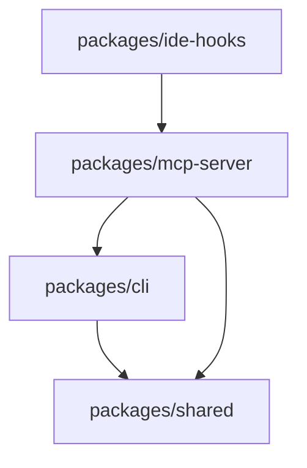

# Directory Structure

This document describes the high-level directory structure of the Commit Reflection System.

## Overview

The project is organized as a monorepo using workspaces, with three main components (CLI, MCP Server, IDE Hooks) sharing common code through the `shared` package.

```
ai-commit-reflect/
├── packages/              # Monorepo packages
├── docs/                  # Documentation
├── examples/              # Example configurations and usage
├── tests/                 # Shared test infrastructure
├── .config/               # Default configuration templates
└── [root config files]    # Project-level configuration
```

## Detailed Structure

### `/packages` - Monorepo Packages

Contains all installable packages as npm workspaces.

```
packages/
├── cli/                           # @blueplane/commit-reflect
│   ├── src/
│   │   ├── index.ts               # CLI entry point and argument parsing
│   │   ├── session.ts             # ReflectionSession class (core logic)
│   │   ├── prompts.ts             # Interactive question prompting
│   │   ├── config.ts              # Configuration file loading and validation
│   │   ├── validators.ts          # Input validation functions
│   │   └── utils.ts               # Utility functions
│   ├── bin/
│   │   └── commit-reflect.js      # Executable script
│   ├── tests/
│   │   ├── session.test.ts
│   │   ├── prompts.test.ts
│   │   └── config.test.ts
│   ├── package.json
│   ├── tsconfig.json
│   └── README.md
│
├── mcp-server/                    # @blueplane/mcp-commit-reflect
│   ├── src/
│   │   ├── index.ts               # MCP server entry point
│   │   ├── server.ts              # MCP server implementation
│   │   ├── tools/                 # MCP tool implementations
│   │   │   ├── start-reflection.ts
│   │   │   ├── answer-question.ts
│   │   │   ├── complete-reflection.ts
│   │   │   ├── cancel-reflection.ts
│   │   │   └── get-reflections.ts
│   │   ├── process-manager.ts     # CLI process lifecycle management
│   │   └── types.ts               # MCP-specific types
│   ├── tests/
│   │   ├── server.test.ts
│   │   ├── tools.test.ts
│   │   └── process-manager.test.ts
│   ├── package.json
│   ├── tsconfig.json
│   └── README.md
│
├── ide-hooks/                     # IDE integration hooks
│   ├── claude-code/
│   │   ├── post-tool-use.js       # Claude Code PostToolUse hook
│   │   ├── README.md              # Installation and usage guide
│   │   └── package.json
│   ├── cursor/
│   │   ├── afterShellExecution.ts # Cursor shell execution hook
│   │   ├── README.md              # Installation and usage guide
│   │   └── package.json
│   └── README.md                  # General IDE hooks overview
│
└── shared/                        # @blueplane/commit-reflect-shared
    ├── types/
    │   ├── reflection.ts          # Core reflection types
    │   ├── config.ts              # Configuration types
    │   ├── mcp.ts                 # MCP protocol types
    │   ├── question.ts            # Question and answer types
    │   └── storage.ts             # Storage backend interfaces
    ├── storage/
    │   ├── base.ts                # Abstract StorageBackend class
    │   ├── jsonl.ts               # JSONL storage implementation
    │   ├── sqlite.ts              # SQLite storage implementation
    │   ├── git.ts                 # Git commit message storage
    │   └── index.ts               # Storage backend factory
    ├── utils/
    │   ├── git.ts                 # Git utility functions
    │   ├── time.ts                # Timestamp utilities
    │   └── validation.ts          # Shared validation functions
    ├── tests/
    │   ├── storage.test.ts
    │   └── utils.test.ts
    ├── package.json
    ├── tsconfig.json
    └── README.md
```

### `/docs` - Documentation

Project documentation including architecture decisions.

```
docs/
├── adr/                           # Architecture Decision Records
│   ├── README.md                  # ADR index and guidelines
│   ├── 000-template.md            # ADR template
│   ├── 001-cli-first-architecture.md
│   ├── 002-mcp-integration.md
│   ├── 003-multiple-storage-backends.md
│   └── 004-interactive-question-flow.md
├── api/                           # API documentation (future)
│   ├── cli.md
│   └── mcp.md
└── guides/                        # User guides (future)
    ├── getting-started.md
    ├── configuration.md
    └── ide-setup.md
```

### `/examples` - Example Configurations

Real-world examples for users to reference.

```
examples/
├── minimal-config.json            # Simplest configuration
├── full-config.json               # All options demonstrated
├── custom-questions.json          # Custom question set example
├── team-config.json               # Team-oriented setup
├── sample-reflection.jsonl        # Example JSONL output
├── queries/                       # Example SQLite queries
│   ├── average-synergy.sql
│   ├── recent-blockers.sql
│   └── learning-moments.sql
└── hooks/                         # Example hook implementations
    ├── git-post-commit
    └── git-pre-push
```

### `/tests` - Test Infrastructure

Shared test utilities and end-to-end tests.

```
tests/
├── fixtures/                      # Test fixtures and mock data
│   ├── commits/
│   ├── configs/
│   └── reflections/
├── helpers/                       # Test helper functions
│   ├── git.ts                     # Git test utilities
│   ├── cli.ts                     # CLI test runners
│   └── mcp.ts                     # MCP test client
├── integration/                   # Cross-package integration tests
│   ├── cli-to-storage.test.ts
│   └── mcp-to-cli.test.ts
├── e2e/                          # End-to-end workflow tests
│   ├── claude-code-workflow.test.ts
│   └── cli-workflow.test.ts
└── setup.ts                       # Global test setup
```

### `/.config` - Configuration Templates

Default configuration files and schemas.

```
.config/
├── commit-reflect.example.json    # Example configuration file
├── commit-reflect.schema.json     # JSON schema for validation
└── default-questions.json         # Default question set
```

### Root Configuration Files

```
ai-commit-reflect/
├── package.json                   # Monorepo root package.json
├── tsconfig.json                  # Root TypeScript configuration
├── tsconfig.build.json            # Build-specific TS config
├── .eslintrc.json                 # ESLint configuration
├── .prettierrc                    # Prettier configuration
├── vitest.config.ts               # Vitest test configuration
├── .gitignore                     # Git ignore rules
├── .npmignore                     # npm publish ignore rules
├── LICENSE                        # License file
├── README.md                      # Main project README
├── CONTRIBUTING.md                # Contribution guidelines
├── DIRECTORY_STRUCTURE.md         # This file
├── CHANGELOG.md                   # Version history
└── .github/                       # GitHub-specific files
    ├── workflows/
    │   ├── test.yml
    │   ├── lint.yml
    │   └── release.yml
    ├── ISSUE_TEMPLATE/
    └── PULL_REQUEST_TEMPLATE.md
```

## Package Dependencies



**Dependency Rules:**

1. `shared` package has no internal dependencies (foundation)
2. `cli` depends only on `shared` (standalone functionality)
3. `mcp-server` depends on `shared` and spawns `cli` processes
4. `ide-hooks` interact with `mcp-server` via MCP protocol

## Build Outputs

```
packages/
├── cli/
│   └── dist/                      # Compiled JavaScript
│       ├── index.js
│       ├── index.d.ts
│       └── ...
├── mcp-server/
│   └── dist/
│       ├── index.js
│       ├── index.d.ts
│       └── ...
└── shared/
    └── dist/
        ├── index.js
        ├── index.d.ts
        └── ...
```

## Data Storage Locations

### User Data (default paths)

```
~/.commit-reflect/
├── reflections.db                 # SQLite database
├── config.json                    # User-level config
└── cache/                         # Temporary data
    └── sessions/                  # Active MCP sessions
```

### Project Data

```
<project-root>/
├── .commit-reflections.jsonl      # JSONL reflection log
├── .commit-reflect.json           # Project-specific config
└── .git/
    └── hooks/
        └── post-commit            # Optional git hook
```

## Development vs Production

### Development

```bash
# Work in packages/cli/src/
cd packages/cli
npm run dev -- --project test --commit HEAD

# TypeScript files executed directly via tsx
```

### Production

```bash
# Compiled to packages/cli/dist/
npm run build

# Installed globally
npm install -g @blueplane/commit-reflect

# Executed from anywhere
commit-reflect --project my-app --commit HEAD
```

## Notes

- All TypeScript source in `src/` directories
- All compiled output in `dist/` directories
- All tests co-located with source or in `tests/` directories
- All documentation in `/docs` except package-specific READMEs
- Configuration files in `/.config` for templates, project root for active config
- Examples provide copy-paste starting points for users

## Future Structure Additions

As the project evolves, these directories may be added:

```
packages/
├── analytics/                     # Analytics and reporting tools
├── web-dashboard/                 # Optional web UI
└── vscode-extension/              # VS Code extension

docs/
├── architecture/                  # System architecture diagrams
└── tutorials/                     # Step-by-step tutorials

scripts/
├── migrate.ts                     # Data migration scripts
└── setup-dev.sh                   # Development environment setup
```
