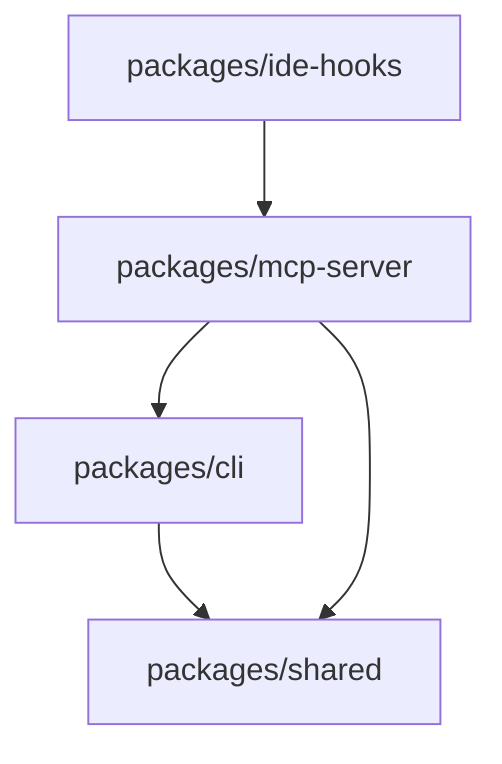

# Directory Structure

This document describes the high-level directory structure of the Commit Reflection System.

## Overview

The project is organized as a monorepo with three main components (CLI, MCP Server, IDE Hooks) sharing common code through the `shared` package.

```
ai-commit-reflect/
├── packages/              # Python packages
├── docs/                  # Documentation
├── examples/              # Example configurations and usage
├── tests/                 # Shared test infrastructure
├── .commit-reflect/       # Configuration directory
│   ├── config.json        # Project-level configuration
│   └── examples/          # Example configurations
└── [root config files]    # Project-level configuration
```

## Detailed Structure

### `/packages` - Python Packages

Contains all installable Python packages.

```
packages/
├── cli/                           # commit-reflect CLI
│   ├── src/
│   │   ├── __init__.py
│   │   ├── __main__.py            # CLI entry point and argument parsing
│   │   ├── session.py             # ReflectionSession class (core logic)
│   │   ├── prompts.py             # Interactive question prompting
│   │   ├── config.py              # Configuration file loading and validation
│   │   ├── validators.py          # Input validation functions
│   │   └── utils.py               # Utility functions
│   ├── tests/
│   │   ├── test_session.py
│   │   ├── test_prompts.py
│   │   └── test_config.py
│   ├── pyproject.toml
│   ├── setup.py
│   └── README.md
│
├── mcp-server/                    # mcp-commit-reflect server
│   ├── src/
│   │   ├── __init__.py
│   │   ├── __main__.py            # MCP server entry point
│   │   ├── server.py              # MCP server implementation
│   │   ├── tools/                 # MCP tool implementations
│   │   │   ├── __init__.py
│   │   │   ├── start_reflection.py
│   │   │   ├── answer_question.py
│   │   │   ├── complete_reflection.py
│   │   │   ├── cancel_reflection.py
│   │   │   └── get_reflections.py
│   │   ├── process_manager.py     # CLI process lifecycle management
│   │   └── types.py               # MCP-specific types
│   ├── tests/
│   │   ├── test_server.py
│   │   ├── test_tools.py
│   │   └── test_process_manager.py
│   ├── pyproject.toml
│   ├── setup.py
│   └── README.md
│
├── ide-hooks/                     # IDE integration hooks
│   ├── claude-code/
│   │   ├── post_tool_use.py       # Claude Code PostToolUse hook
│   │   └── README.md              # Installation and usage guide
│   ├── cursor/
│   │   ├── after_shell_execution.py  # Cursor shell execution hook
│   │   └── README.md              # Installation and usage guide
│   └── README.md                  # General IDE hooks overview
│
└── shared/                        # commit-reflect-shared utilities
    ├── types/
    │   ├── __init__.py
    │   ├── reflection.py          # Core reflection types
    │   ├── config.py              # Configuration types
    │   ├── mcp.py                 # MCP protocol types
    │   ├── question.py            # Question and answer types
    │   └── storage.py             # Storage backend interfaces
    ├── storage/
    │   ├── __init__.py
    │   ├── base.py                # Abstract StorageBackend class
    │   ├── jsonl.py               # JSONL storage implementation
    │   ├── sqlite.py              # SQLite storage implementation
    │   ├── git.py                 # Git commit message storage
    │   └── factory.py             # Storage backend factory
    ├── utils/
    │   ├── __init__.py
    │   ├── git.py                 # Git utility functions
    │   ├── time.py                # Timestamp utilities
    │   └── validation.py          # Shared validation functions
    ├── tests/
    │   ├── test_storage.py
    │   └── test_utils.py
    ├── pyproject.toml
    ├── setup.py
    └── README.md
```

### `/docs` - Documentation

Project documentation including architecture decisions.

```
docs/
└── adr/                           # Architecture Decision Records
    ├── README.md                  # ADR index and guidelines
    ├── 000-template.md            # ADR template
    ├── 001-cli-first-architecture.md
    ├── 002-mcp-integration.md
    ├── 003-multiple-storage-backends.md
    └── 004-interactive-question-flow.md
```

### `/examples` - Example Configurations

Real-world examples for users to reference.

```
examples/
├── minimal-config.json            # Simplest configuration
├── full-config.json               # All options demonstrated
├── custom-questions.json          # Custom question set example
├── team-config.json               # Team-oriented setup
├── sample-reflection.jsonl        # Example JSONL output
├── queries/                       # Example SQLite queries
│   ├── average-synergy.sql
│   ├── recent-blockers.sql
│   └── learning-moments.sql
└── hooks/                         # Example hook implementations
    ├── git-post-commit
    └── git-pre-push
```

### `/tests` - Test Infrastructure

Shared test utilities and end-to-end tests.

```
tests/
├── fixtures/                      # Test fixtures and mock data
│   ├── commits/
│   ├── configs/
│   └── reflections/
├── helpers/                       # Test helper functions
│   ├── git.py                     # Git test utilities
│   ├── cli.py                     # CLI test runners
│   └── mcp.py                     # MCP test client
├── integration/                   # Cross-package integration tests
│   ├── test_cli_to_storage.py
│   └── test_mcp_to_cli.py
├── e2e/                          # End-to-end workflow tests
│   ├── test_claude_code_workflow.py
│   └── test_cli_workflow.py
└── conftest.py                    # Pytest configuration
```

### `/.commit-reflect` - Configuration Directory

Project-level configuration and examples.

```
.commit-reflect/
├── config.json                    # Project-specific configuration
└── examples/                      # Example configuration files
    ├── minimal-config.json        # Minimal configuration example
    ├── full-config.json           # Full configuration example
    └── team-config.json           # Team configuration example
```

### Root Configuration Files

```
ai-commit-reflect/
├── pyproject.toml                 # Python project configuration
├── setup.py                       # Package setup script
├── requirements.txt               # Production dependencies
├── requirements-dev.txt           # Development dependencies
├── pytest.ini                     # Pytest configuration
├── .flake8                        # Flake8 linting configuration
├── .mypy.ini                      # MyPy type checking configuration
├── .gitignore                     # Git ignore rules
├── LICENSE                        # License file
├── README.md                      # Main project README
├── DIRECTORY_STRUCTURE.md         # This file
├── CHANGELOG.md                   # Version history
└── .github/                       # GitHub-specific files
    ├── workflows/
    │   ├── test.yml
    │   ├── lint.yml
    │   └── release.yml
    ├── ISSUE_TEMPLATE/
    └── PULL_REQUEST_TEMPLATE.md
```

## Package Dependencies



**Dependency Rules:**

1. `shared` package has no internal dependencies (foundation)
2. `cli` depends only on `shared` (standalone functionality)
3. `mcp-server` depends on `shared` and spawns `cli` processes
4. `ide-hooks` interact with `mcp-server` via MCP protocol

## Data Storage Locations

### User Data (default paths)

```
~/.commit-reflect/
├── reflections.db                 # SQLite database
├── config.json                    # User-level config
└── cache/                         # Temporary data
    └── sessions/                  # Active MCP sessions
```

### Project Data

```
<project-root>/
├── .commit-reflections.jsonl      # JSONL reflection log
├── .commit-reflect/               # Configuration directory
│   └── config.json                # Project-specific config
└── .git/
    └── hooks/
        └── post-commit            # Optional git hook
```

## Development vs Production

### Development

```bash
# Work in packages/cli/src/
cd packages/cli

# Install in editable mode
pip install -e .

# Run directly
python -m commit_reflect --project test --commit HEAD
```

### Production

```bash
# Install from PyPI
pip install commit-reflect

# Executed from anywhere
commit-reflect --project my-app --commit HEAD
```

## Notes

- All Python source in `src/` directories with `__init__.py` for package structure
- All tests co-located with source or in `tests/` directories using pytest
- All documentation in `/docs` except package-specific READMEs
- Configuration files in `/.config` for templates, project root for active config
- Examples provide copy-paste starting points for users
- SQLite database used for structured storage (included with Python standard library)
