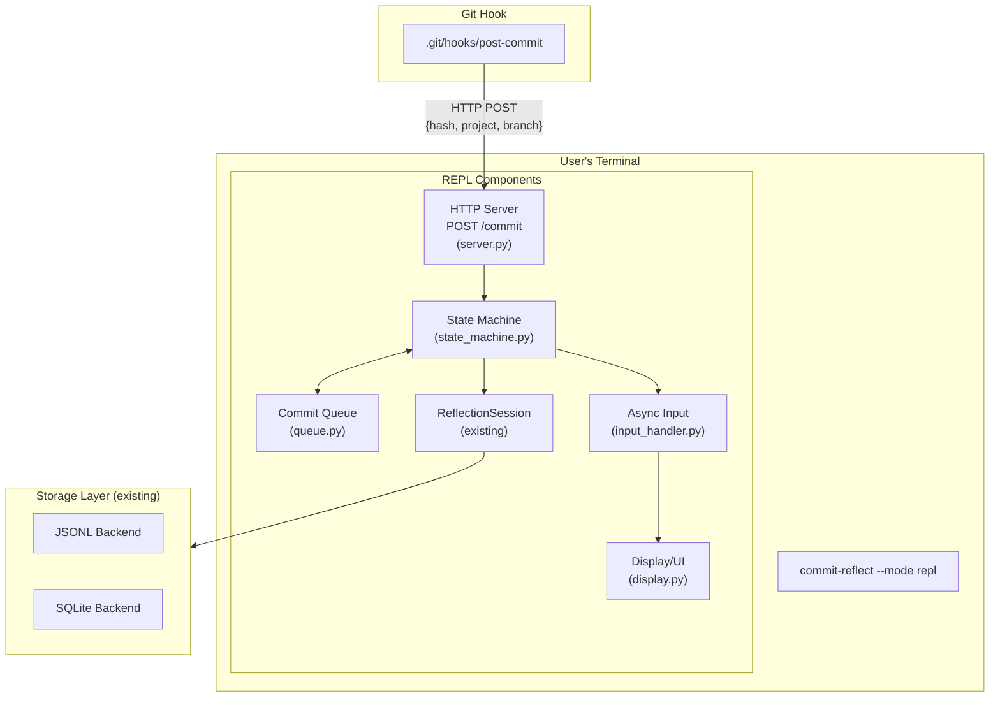
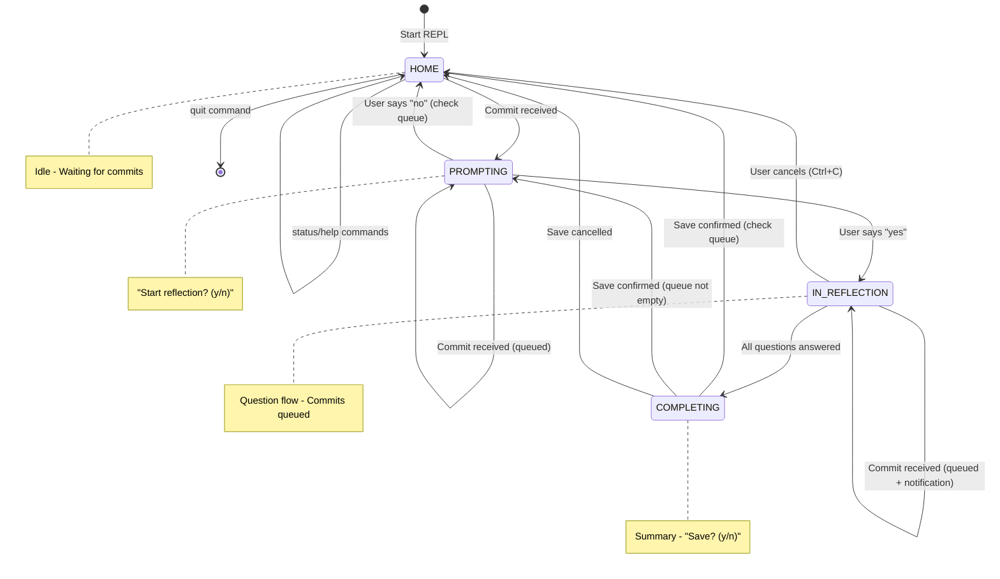
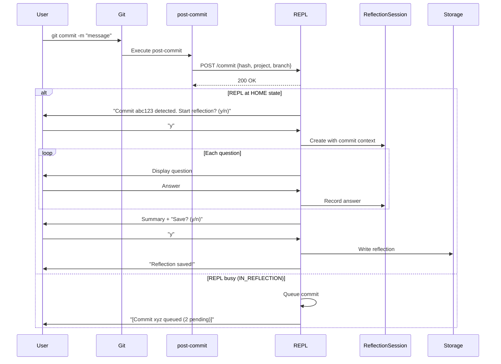

# REPL Mode Implementation Plan

## Overview

This document outlines the implementation plan for adding REPL mode to the commit-reflect system. REPL mode provides a persistent, always-on terminal interface that listens for git commits via native git hooks and prompts users for reflections interactively.

**Related ADR:** [ADR-005: REPL Mode with Git Hook Integration](./adr/005-repl-mode-git-hook-integration.md)

## Architecture



## State Machine



## Data Flow



## File Structure

```
packages/cli/
├── src/
│   ├── repl/
│   │   ├── __init__.py           # Package exports
│   │   ├── state_machine.py      # REPLState enum, StateMachine class
│   │   ├── queue.py              # QueuedCommit, CommitQueue
│   │   ├── server.py             # CommitNotificationServer (asyncio)
│   │   ├── input_handler.py      # AsyncInputHandler
│   │   ├── display.py            # REPLDisplay
│   │   └── repl_session.py       # REPLMode orchestration
│   └── main.py                   # Add --mode repl, install-hook
├── hooks/
│   ├── post-commit               # Git hook shell script
│   └── install.py                # Hook installation utility
```

## Implementation Phases

```mermaid
gantt
    title REPL Mode Implementation
    dateFormat X
    axisFormat Phase %s

    section Phase 1: Core
    state_machine.py     :p1a, 0, 1
    queue.py             :p1b, 0, 1
    __init__.py          :p1c, 0, 1

    section Phase 2: Server
    server.py            :p2, 1, 2

    section Phase 3: Input
    input_handler.py     :p3, 1, 2

    section Phase 4: Display
    display.py           :p4, 1, 2

    section Phase 5: Orchestration
    repl_session.py      :p5, 2, 4

    section Phase 6: CLI
    main.py updates      :p6, 4, 5

    section Phase 7: Hooks
    post-commit          :p7a, 5, 6
    install.py           :p7b, 5, 6
```



---

## Phase 1: Core Infrastructure

**Goal:** Create foundational data structures for state management and commit queuing.

### Files to Create

#### `packages/cli/src/repl/state_machine.py`

```python
class REPLState(Enum):
    HOME = auto()           # Idle, waiting for commits
    PROMPTING = auto()      # "Start reflection?" prompt
    IN_REFLECTION = auto()  # Question flow active
    COMPLETING = auto()     # Summary + save confirmation

@dataclass
class StateContext:
    current_commit_hash: Optional[str] = None
    pending_count: int = 0
    current_question_index: int = 0
    last_error: Optional[str] = None
    metadata: dict = field(default_factory=dict)

class StateMachine:
    def __init__(self, initial_state: REPLState = REPLState.HOME)
    def transition_to(self, new_state: REPLState, context_updates: dict = None) -> bool
    def is_busy(self) -> bool  # True if IN_REFLECTION or COMPLETING
    def is_idle(self) -> bool  # True if HOME
    def can_transition_to(self, target: REPLState) -> bool
    def on_transition(self, callback: Callable) -> None
    def reset(self) -> None
```

#### `packages/cli/src/repl/queue.py`

```python
@dataclass
class QueuedCommit:
    commit_hash: str
    project: str
    branch: str
    received_at: datetime

    @property
    def short_hash(self) -> str  # First 7 chars

class CommitQueue:
    def __init__(self, max_size: int = 100)
    def enqueue(self, commit: QueuedCommit) -> int  # Returns queue size
    def dequeue(self) -> Optional[QueuedCommit]     # Get next, set as current
    def peek(self) -> Optional[QueuedCommit]        # Look without removing
    @property
    def size(self) -> int
    @property
    def current(self) -> Optional[QueuedCommit]     # Currently processing
    def clear_current(self) -> None
    def get_all(self) -> List[QueuedCommit]         # For display
```

#### `packages/cli/src/repl/__init__.py`

```python
from .state_machine import REPLState, StateMachine, StateContext
from .queue import QueuedCommit, CommitQueue

__all__ = [
    "REPLState",
    "StateMachine",
    "StateContext",
    "QueuedCommit",
    "CommitQueue",
]
```

### Tests

- State machine transition validation
- Invalid transition rejection
- Context updates on transition
- Queue operations (enqueue, dequeue, peek)
- Queue size limits

---

## Phase 2: HTTP Server

**Goal:** Create minimal asyncio HTTP server to receive commit notifications.

### File to Create

#### `packages/cli/src/repl/server.py`

```python
class CommitNotificationServer:
    def __init__(
        self,
        port: int = 9123,
        host: str = "127.0.0.1",
        on_commit: Optional[Callable[[QueuedCommit], None]] = None
    )

    async def start(self) -> None
    async def stop(self) -> None

    @property
    def is_running(self) -> bool

    # Internal
    async def _handle_connection(self, reader, writer) -> None
    def _parse_commit_request(self, request: str) -> Optional[QueuedCommit]
```

**Protocol:**
- Listens on configurable port (default 9123)
- Accepts POST `/commit` requests
- Parses URL-encoded body: `hash=abc&project=foo&branch=main`
- Also accepts JSON body: `{"hash": "abc", "project": "foo", "branch": "main"}`
- Returns `200 OK` on success, `404 Not Found` for other paths

### Tests

- Server starts and binds to port
- Accepts POST /commit with URL-encoded body
- Accepts POST /commit with JSON body
- Returns 404 for unknown paths
- Calls on_commit callback with parsed data
- Graceful shutdown

---

## Phase 3: Async Input Handler

**Goal:** Handle stdin input asynchronously alongside HTTP server.

### File to Create

#### `packages/cli/src/repl/input_handler.py`

```python
class AsyncInputHandler:
    def __init__(self)

    async def start(self) -> None   # Register stdin reader with event loop
    async def stop(self) -> None    # Unregister stdin reader

    async def get_input(self, timeout: Optional[float] = None) -> Optional[str]
    async def prompt(self, message: str, timeout: Optional[float] = None) -> Optional[str]
```

**Implementation Notes:**
- Uses `asyncio.get_event_loop().add_reader()` for non-blocking stdin on Unix
- Falls back to threading on Windows if needed
- Handles `EOFError` and `KeyboardInterrupt` gracefully

### Tests

- Input received without blocking
- Timeout returns None
- Prompt displays message before waiting
- Graceful handling of Ctrl+C

---

## Phase 4: Display

**Goal:** Terminal output helpers for consistent UX.

### File to Create

#### `packages/cli/src/repl/display.py`

```python
class REPLDisplay:
    def show_welcome(self, project: str, port: int) -> None
    def show_idle_prompt(self) -> None
    def show_commit_detected(self, commit: QueuedCommit, pending_count: int) -> None
    def show_queued_notification(self, commit: QueuedCommit, queue_size: int) -> None
    def show_question(self, question: Question, progress: Tuple[int, int]) -> None
    def show_validation_error(self, error: Optional[str]) -> None
    def show_summary(self, answers: Dict[str, Any], questions: List[Question]) -> None
    def show_completion(self) -> None
    def show_queue_status(self, queue: CommitQueue) -> None
    def show_error(self, message: str) -> None
    def show_message(self, message: str) -> None
```

**Output Format:**
```
============================================================
COMMIT REFLECT REPL
============================================================
Project: my-project
Listening for commits on port 9123
Commands: 'status' (show queue), 'quit' (exit)
============================================================

[Waiting for commits...]

------------------------------------------------------------
Commit detected: abc1234
  Project: my-project
  Branch: feature/foo
  (2 more commit(s) in queue)
------------------------------------------------------------
Start reflection? (y/n):
```

### Tests

- Output format matches specification
- Progress displays correctly
- Queue status shows all pending commits

---

## Phase 5: Main REPL Orchestration

**Goal:** Tie all components together into cohesive REPL experience.

### File to Create

#### `packages/cli/src/repl/repl_session.py`

```python
class REPLMode:
    def __init__(
        self,
        project: str,
        port: int = 9123,
        config: Optional[Config] = None
    )

    async def run(self) -> int  # Main loop, returns exit code

    # State handlers
    async def _handle_home_state(self) -> None
    async def _handle_prompting_state(self) -> None
    async def _handle_reflection_state(self) -> None
    async def _handle_completing_state(self) -> None

    # Event handlers
    def _on_commit(self, commit: QueuedCommit) -> None

    # Cleanup
    async def _cleanup(self) -> None


async def run_repl_mode(
    project: str,
    port: int = 9123,
    config: Optional[Config] = None
) -> int:
    """Entry point for REPL mode."""
    repl = REPLMode(project=project, port=port, config=config)
    return await repl.run()
```

**Integration with Existing Code:**
- Uses `ReflectionSession` from `packages/cli/src/session.py`
- Uses `get_commit_context()` from `packages/cli/src/git_utils.py`
- Uses `create_storage_from_config()` from `packages/shared/storage/factory.py`
- Uses `create_default_question_set()` from `packages/shared/types/question.py`

### Tests

- Full lifecycle: start → commit received → reflection → save → stop
- Queue processing after reflection completes
- Cancellation with Ctrl+C
- Graceful shutdown

---

## Phase 6: CLI Integration

**Goal:** Add REPL mode to main CLI entry point.

### File to Modify

#### `packages/cli/src/main.py`

Add new arguments:
```python
parser.add_argument(
    "--mode",
    choices=["cli", "mcp-session", "repl"],
    default="cli",
    help="Operating mode"
)
parser.add_argument(
    "--port",
    type=int,
    default=9123,
    help="Port for REPL HTTP server (default: 9123)"
)

# New subcommands
subparsers = parser.add_subparsers(dest="command")

install_parser = subparsers.add_parser("install-hook", help="Install git post-commit hook")
install_parser.add_argument("--force", action="store_true", help="Overwrite existing hook")

uninstall_parser = subparsers.add_parser("uninstall-hook", help="Remove git post-commit hook")
```

**CLI Interface:**
```bash
# Start REPL mode
commit-reflect --mode repl [--port 9123] [--project NAME]

# Install git hook
commit-reflect install-hook [--force]

# Uninstall git hook
commit-reflect uninstall-hook
```

### Tests

- `--mode repl` launches REPL mode
- `--port` configures server port
- `install-hook` creates hook file
- `uninstall-hook` removes hook file

---

## Phase 7: Git Hook

**Goal:** Create git hook and installation utility.

### Files to Create

#### `packages/cli/hooks/post-commit`

```bash
#!/bin/sh
#
# post-commit hook for commit-reflect REPL integration
# Sends commit notification to REPL server (fails silently if not running)
#

REPL_PORT="${COMMIT_REFLECT_PORT:-9123}"
REPL_HOST="${COMMIT_REFLECT_HOST:-127.0.0.1}"
TIMEOUT=2

COMMIT_HASH=$(git rev-parse HEAD)
PROJECT=$(basename "$(git rev-parse --show-toplevel)")
BRANCH=$(git rev-parse --abbrev-ref HEAD 2>/dev/null || echo "unknown")

# Attempt to notify REPL server (fail silently)
curl -s --max-time "$TIMEOUT" \
    -X POST "http://${REPL_HOST}:${REPL_PORT}/commit" \
    -d "hash=${COMMIT_HASH}&project=${PROJECT}&branch=${BRANCH}" \
    >/dev/null 2>&1 || true

# Always exit successfully (don't block commit)
exit 0
```

#### `packages/cli/hooks/install.py`

```python
HOOK_SCRIPT = '''#!/bin/sh
# ... (embedded script content)
'''

def install_hook(repo_path: Optional[Path] = None, force: bool = False) -> bool:
    """Install post-commit hook in git repository."""

def uninstall_hook(repo_path: Optional[Path] = None) -> bool:
    """Remove post-commit hook from git repository."""

def is_hook_installed(repo_path: Optional[Path] = None) -> bool:
    """Check if our hook is installed."""
```

### Tests

- Hook script executes without error
- Hook sends correct POST request
- Hook fails silently when server not running
- install_hook creates executable file
- install_hook respects --force flag
- uninstall_hook removes only our hook

---

## Dependencies on Existing Code

| Existing File | Import | Usage |
|---------------|--------|-------|
| `packages/cli/src/session.py` | `ReflectionSession` | Question flow and answer management |
| `packages/cli/src/git_utils.py` | `get_commit_context()` | Build CommitContext from hash |
| `packages/shared/storage/factory.py` | `create_storage_from_config()` | Write reflections to backends |
| `packages/shared/types/question.py` | `create_default_question_set()` | Get question definitions |
| `packages/shared/types/config.py` | `Config` | Load configuration |

---

## Environment Variables

| Variable | Default | Description |
|----------|---------|-------------|
| `COMMIT_REFLECT_PORT` | `9123` | Port for HTTP server |
| `COMMIT_REFLECT_HOST` | `127.0.0.1` | Host to bind (localhost only) |

---

## Error Handling

| Scenario | Behavior |
|----------|----------|
| Port already in use | Exit with clear error: "Port 9123 is already in use. Try --port 9124" |
| Hook POST fails | Silent failure in hook (don't block commit) |
| Invalid commit hash | Log warning, skip notification |
| Ctrl+C during reflection | Cancel session, return to HOME state |
| Storage write fails | Show error, offer to retry or skip |
| Malformed HTTP request | Return 400 Bad Request, log warning |

---

## Testing Strategy

### Unit Tests
- State machine transitions (valid and invalid)
- Queue operations (enqueue, dequeue, overflow)
- HTTP request parsing (URL-encoded, JSON, malformed)
- Display output formatting

### Integration Tests
- Server receives POST and calls callback
- Full REPL lifecycle with mocked stdin
- Hook installation and uninstallation

### Manual Testing
- End-to-end with real git commits
- Multiple rapid commits (queue behavior)
- Ctrl+C cancellation at each state
- Cross-platform (macOS, Linux)

---

## Success Criteria

### MVP Complete When:
1. `commit-reflect --mode repl` starts and listens on port
2. `commit-reflect install-hook` installs working hook
3. Git commit triggers notification to REPL
4. REPL prompts user and collects reflection
5. Reflection saved to storage backends
6. Multiple commits queue correctly
7. Ctrl+C exits gracefully

### Quality Gates:
- All unit tests pass
- Integration tests pass
- Manual E2E testing complete
- Documentation updated

---

## Future Enhancements (Out of Scope)

- Session recovery after crash
- Multi-project support (multiple repos)
- Rich terminal UI (colors, progress bars)
- Authentication for HTTP endpoint
- WebSocket for bidirectional communication
- Configuration file for REPL settings
- Hook chaining (preserve existing post-commit hooks)
