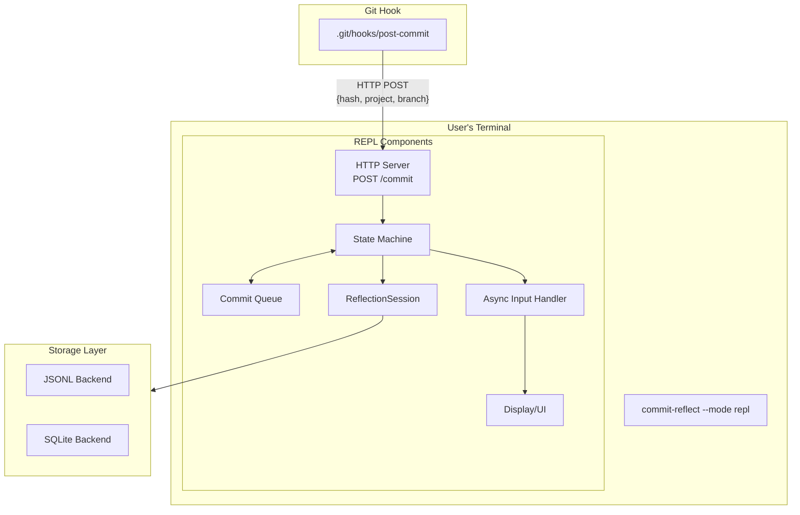
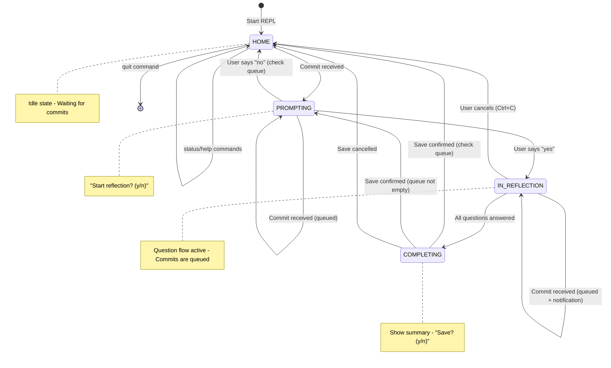

# ADR-005: REPL Mode with Git Hook Integration

## Status

Proposed

## Context

The commit-reflect tool currently operates in two modes:
- **CLI mode**: Interactive terminal session triggered manually by running `commit-reflect`
- **MCP mode**: Integration with Claude Code via the Model Context Protocol (ADR-002)

Users want a persistent, always-on interface that:
1. Automatically detects when commits are made from any terminal or IDE
2. Prompts for reflection without requiring manual invocation
3. Supports interactive use while listening for commit events
4. Works independently of AI-powered IDEs

The existing Claude Code hook (`PostToolUse.py`) only works within the Claude Code IDE environment. Developers making commits from standard terminals, VS Code without Claude Code, or other tools have no automatic integration path.

Key requirements:
- Detect commits made from any git client (terminal, IDE, GUI)
- Non-blocking: don't interrupt commit workflow if REPL isn't running
- Queue commits when user is mid-reflection
- Reuse existing reflection session and storage infrastructure

## Decision

We will implement a **REPL mode** that:

1. Runs as a persistent terminal process (`commit-reflect --mode repl`)
2. Listens for HTTP notifications from a native git `post-commit` hook
3. Uses a state machine to manage interactive prompts vs. queued notifications
4. Reuses existing `ReflectionSession` and storage backends from CLI mode

### Architecture



### State Machine Design



### Communication Protocol

The git hook sends a simple HTTP POST to the REPL server:

```bash
curl -X POST http://127.0.0.1:9123/commit \
    -d "hash=${COMMIT_HASH}&project=${PROJECT}&branch=${BRANCH}"
```

The REPL server responds with `200 OK` and processes the notification asynchronously.

## Consequences

### Positive

- **Universal commit detection**: Works with any git client (terminal, IDE, GUI)
- **Non-intrusive**: Hook fails silently if REPL not running, doesn't block commits
- **Reuses existing code**: Leverages `ReflectionSession`, storage backends, question flow
- **Simple protocol**: HTTP POST is universal, easy to debug with curl
- **Queuing**: Multiple rapid commits don't lose data; processed in order
- **Interactive UX**: User gets prompted at natural pause points, not mid-thought
- **Complements MCP mode**: Users can choose REPL for terminal workflows, MCP for AI workflows

### Negative

- **Port binding**: Only one REPL instance per port; can't watch multiple projects simultaneously
- **Localhost only**: No authentication for POC; security consideration for future
- **Platform differences**: Async stdin handling varies between Unix and Windows
- **Curl dependency**: Hook requires curl to be installed (widely available)
- **Manual hook installation**: User must run `commit-reflect install-hook` per repository

### Neutral

- **Third mode**: REPL is a separate mode alongside CLI and MCP, not a replacement
- **Separate process**: REPL runs independently from IDE; some users may prefer integrated
- **Memory-only queue**: Queued commits lost on crash (acceptable for POC)

## Alternatives Considered

### File-based IPC (inotify/fswatch)

Watch a file or directory for changes written by git hooks.

**Pros:**
- No network stack needed
- Works offline
- Simple implementation

**Cons:**
- Platform-specific file watching (inotify on Linux, fsevents on macOS, different on Windows)
- Can't pass structured metadata in filename easily
- Harder to debug than HTTP
- Race conditions with file creation/deletion

### Unix Domain Socket

Use a Unix socket instead of HTTP for IPC.

**Pros:**
- No port management
- Slightly lower overhead than HTTP
- Built-in access control via filesystem permissions

**Cons:**
- Not cross-platform (Windows uses named pipes)
- Harder to debug (can't use curl)
- Less tooling available
- HTTP is more familiar to most developers

### Extend MCP Mode

Add REPL-like functionality to the existing MCP mode.

**Pros:**
- Single integration point
- Leverages AI agent capabilities

**Cons:**
- MCP is for AI integration; REPL serves different use case (terminal-first)
- Would add complexity to MCP server
- MCP requires AI tool to be running
- Not all developers use AI-powered IDEs

### Polling git log

Periodically poll `git log` to detect new commits.

**Pros:**
- No hook installation needed
- Works retroactively

**Cons:**
- Inefficient (constant polling)
- Delayed detection (depends on poll interval)
- Can miss commits if interval too long
- CPU/disk overhead from repeated git operations
- More complex to detect "new" commits reliably

## References

- ADR-001: CLI-First Architecture
- ADR-002: MCP Integration
- ADR-004: Interactive Question Flow
- [Git Hooks Documentation](https://git-scm.com/book/en/v2/Customizing-Git-Git-Hooks)
- [Python asyncio Documentation](https://docs.python.org/3/library/asyncio.html)
